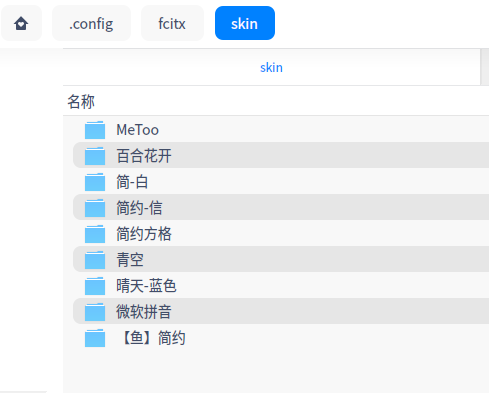

# fcitx-skins

> 适用于 fcitx4 的皮肤内容

## 安装/配置/使用

> 皮肤存储目录，没有就创建

- 皮肤文件路径\
    `~/.config/fcitx/skin`
- 配置文件路径\
    `~/.config/fcitx/conf/fcitx-classic-ui.config`

- 皮肤内容
    ``` bash
    # 复制所有皮肤到 `~/.config/fcitx/skin` 目录
    zinface@zinface-PC:~/.config/fcitx/skin$ tree -L 1
    .
    ├── 百合花开
    ├── 简-白
    ├── 简约方格
    ├── 简约-信
    ├── 青空
    ├── 晴天-蓝色
    ├── 微软拼音
    ├── 【鱼】简约
    └── MeToo
    ```
    

- 准备好fcitx后，重启fcitx\
      

- 开始配置fcitx使用的皮肤
    > 配置需要使用的皮肤(目录名称)\
    > 建议使用配置工具进行配置，如果目录名称匹配成功，将会立即自动更新相应为配置名称\
    > 可使用拥有自动显示更新文件内容的编辑器查看被即时更新的配置文件(配置工具)\
    > 使用 vscode 打开 ~/.config/fcitx/conf/fcitx-classic-ui.config 即可查看或手动配置(不会自动生效)

      

      
    

## 灵感来源/内容搜集

- [V20风格的输入法皮肤，欢迎大家体验～][bbs]


[bbs]: https://bbs.deepin.org/post/196126